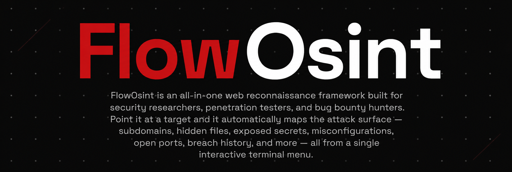

# FlowOsint



**Advanced Web Reconnaissance & OSINT Tool**

No API keys required. No accounts. Just Python and a target you're authorised to test.

[](https://python.org)
[](LICENSE)
[](README.md)

**Contributors:** [@FlowThingy](https://github.com/FlowThingy) · [@jelloyfizz-jpg](https://github.com/jelloyfizz-jpg)

---

## Table of Contents

- [What it does](#what-it-does)
- [Requirements](#requirements)
- [Installation](#installation)
- [Quick start](#quick-start)
- [Module reference](#module-reference)
- [Output files](#output-files)
- [Settings](#settings)
- [FAQ](#faq)
- [Troubleshooting](#troubleshooting)
- [Legal & Disclaimer](#legal--disclaimer)

---

## What it does

FlowOsint runs 55 modules across reconnaissance, vulnerability probing, and threat intelligence — all from a single script. Instead of jumping between a dozen tools, you get one menu-driven interface that handles the full passive and active recon workflow.

It finds things like:

- Hidden admin panels, backup files, and config leaks (`/.env`, `/.git`, `/phpinfo.php`)
- API keys, AWS credentials, JWTs, and tokens left in JavaScript files
- Subdomains that the owner forgot about — often running outdated or unprotected software
- Email addresses, internal paths, and developer comments leaked in page source
- Security misconfigurations — missing headers, open CORS, weak TLS ciphers, spoofable email domains
- Open ports and known CVEs pulled from Shodan InternetDB
- Whether the domain or its IP appears in breach databases or threat intelligence feeds

Everything is saved automatically to a timestamped JSON report, a formatted Markdown bug bounty report, a live session log, and a queryable DuckDB database.

---

## Requirements

| Requirement | Details |
|-------------|---------|
| Python | 3.10 or newer — check with `python --version` |
| OS | Windows, Linux, macOS |
| Internet | Required for all network modules |
| API keys | None — all modules work without registration |

---

## Installation

### 1 — Get the files

```bash
git clone https://github.com/FlowThingy/FlowOsint
cd FlowOsint
```

No Git? Download the ZIP from the GitHub page, extract it, and open that folder.

### 2 — Run

That's it. The launchers handle everything else automatically — they create a virtual environment, install all dependencies into it, and launch the tool. You never need to touch `pip` manually.

**Windows:**
```cmd
run.bat
```

**Linux / macOS:**
```bash
chmod +x run.sh && ./run.sh
```

**What happens on first launch:**
```
[*] First run detected - setting up virtual environment...
[+] Virtual environment created.
[*] Checking dependencies...
[+] Dependencies OK.
```

After the first run, it skips straight to `[*] Checking dependencies...` and launches within a few seconds.

> **If something still goes wrong with dependencies**, you can always install manually inside the venv:
> ```bash
> # Windows
> venv\Scripts\activate
> pip install -r requirements.txt
>
> # Linux / macOS
> source venv/bin/activate
> pip install -r requirements.txt
> ```

---

## Quick start

When the tool launches you'll see the main menu — 3 pages of modules, press **`N`** to navigate between them.

**Run a full scan in 3 steps:**

```
1. Type:  01  → Enter          (Full Recon — runs everything)
2. Enter target URL:  https://example.com
3. Wait. Press Enter when done to return to the menu.
```

Reports are saved automatically in the same folder as the script.

**Run individual modules:**

```
S → Settings → option 1 → set target URL
Then type any module number from the menu
```

Setting a target once means you won't be asked for it again each time you run a module.

> **Tip:** Before running anything aggressive, start with `09` (Tech Fingerprint) and `10` (WAF Detect). If the site is behind Cloudflare or a WAF, some modules will generate more noise than others.

---

## Module reference

### Page 1 — Recon & OSINT

| # | Module | Description |
|---|--------|-------------|
| `01` | Full Recon | Runs every module end-to-end. Best starting point for a complete picture. |
| `02` | Dir & File Bruteforce | Tests 200+ common paths (`/admin`, `/.env`, `/backup.zip`, `/phpinfo.php`) for hidden or exposed files |
| `03` | Subdomain Probe | Probes 80+ common subdomain prefixes — `dev.`, `staging.`, `api.`, `git.`, `admin.` |
| `04` | Link & Form Crawler | Recursively spiders the site — maps links, scripts, stylesheets, and forms |
| `05` | JS File Analysis | Downloads every JS file and scans for API keys, AWS creds, JWTs, database URLs, internal endpoints |
| `06` | HTML Comment Dump | Extracts hidden form fields, HTML comments, iframe sources, and sensitive `data-*` attributes |
| `07` | CSS Asset Extractor | Pulls embedded URLs from stylesheets — sometimes reveals internal asset servers |
| `08` | Robots & Sitemap | Parses `robots.txt`, `sitemap.xml`, `security.txt` — `Disallow:` entries often point directly at sensitive paths |
| `09` | Tech Fingerprint | Identifies the tech stack — CMS, framework, server, libraries, CDN |
| `10` | WAF / CDN Detect | Detects Web Application Firewalls and CDNs (Cloudflare, Akamai, Incapsula, ModSec, F5) |
| `11` | Header Inspector | Dumps the full raw HTTP response headers |
| `12` | Cookie Auditor | Lists all cookies and flags missing `HttpOnly` / `Secure` attributes |
| `13` | DNS Record Lookup | Queries A, AAAA, MX, NS, TXT, SOA, CAA, SRV records |
| `14` | WHOIS Lookup | Registrar, creation date, expiry, nameservers |
| `15` | JS Secret Hunter | Same as `05` but uses scripts already collected by the crawler |
| `16` | Hidden Field Dump | Finds all hidden inputs and sensitive data attributes on the page |
| `17` | Form Harvester | Lists every form with its action URL, method, and field names |
| `18` | Email Harvester | Multi-threaded email address scraper across crawled pages |
| `19` | Open Redirect Probe | Tests common redirect parameters for open redirect vulnerabilities |
| `20` | Open Ports Scan | Socket-probes the top 25 ports — finds exposed databases, RDP, Redis, MongoDB |
| `21` | Export Report | Saves everything collected in this session to JSON + Markdown |

### Page 2 — Vulnerability & Intelligence

| # | Module | Description |
|---|--------|-------------|
| `22` | SQLi Error Probe | Sends SQL injection payloads and watches for database error messages in the response |
| `23` | XSS Reflection Test | Tests common parameters for reflected XSS |
| `24` | LFI Path Test | Path traversal probes targeting `/etc/passwd` and `win.ini` |
| `25` | SSL/TLS Inspector | Certificate issuer, expiry, cipher suite strength, Subject Alternative Names |
| `26` | HTTP Methods Test | Checks which HTTP methods the server accepts — `PUT`, `DELETE`, `TRACE` enabled is a finding |
| `27` | Clickjack / CSP Check | Checks for `X-Frame-Options` and `Content-Security-Policy` |
| `28` | CORS Policy Check | Sends a crafted origin header — reflects it back means CORS is misconfigured |
| `29` | IP Geolocation | Resolves to IP and returns location, ISP, ASN, coordinates |
| `30` | Reverse IP Lookup | Other domains hosted on the same IP via HackerTarget |
| `31` | SPF / DMARC Check | Quick email authentication record check |
| `32` | Security Headers Audit | Full audit — HSTS, CSP, X-Content-Type-Options, Referrer-Policy, Permissions-Policy |
| `33` | Google Dork Generator | 20 ready-to-use dorks for the target domain |
| `34` | Shodan InternetDB | Free Shodan lookup — open ports and known CVEs, no API key needed |
| `35` | VirusTotal Domain | Domain reputation across 70+ threat intelligence engines |
| `36` | Wayback Machine | Archive availability, oldest and newest snapshots |
| `37` | GreyNoise IP Check | Whether the server IP is known internet background noise or a malicious actor |
| `38` | urlscan.io Analysis | Full browser-rendered scan — network requests, screenshot, verdict |
| `40` | HaveIBeenPwned | Domain breach source check against the HIBP database |
| `41` | crt.sh CT Logs | Certificate Transparency log search — often reveals subdomains not found by DNS probing |
| `42` | Email Security Audit | Deep SPF, DMARC, and DKIM audit with risk scoring |
| `43` | CMS Context JSON Probe | Tests CMS/API endpoints that sometimes expose user data and config without auth |

### Page 3 — Utilities & Tools

| # | Module | Description |
|---|--------|-------------|
| `44` | Doc Metadata Harvest | Extracts author names, software versions, and internal paths from PDFs and Office documents |
| `45` | Risk Score Report | Scores all findings by severity and confidence, generates the final report |
| `46` | Playwright JS Scan | Headless browser scan — intercepts API calls, reads localStorage and cookies |
| `47` | JS-Rendered Crawl | Crawler using a real browser — finds links that only appear after JavaScript runs |
| `48` | DuckDB Query | Run SQL against the scan database — `SELECT * FROM findings WHERE severity='HIGH'` |
| `49` | Trafilatura Extract | Clean readable text extraction from any page |
| `50` | Batch URL Scanner | Check multiple URLs at once |
| `51` | Hash a String | MD5, SHA1, SHA256, SHA512 |
| `52` | Encode / Decode Base64 | Encode or decode Base64 strings |
| `53` | Extract All URLs | Lists every URL collected during crawling |

---

## Output files

All output is saved automatically in the same directory as the script. Filenames include the domain and a timestamp so scans never overwrite each other.

| File | Contents |
|------|----------|
| `flowoosint_example_com_YYYYMMDD_HHMMSS.json` | Full raw data from every module |
| `flowoosint_example_com_YYYYMMDD_HHMMSS.md` | Formatted bug bounty report — paste into HackerOne / Bugcrowd |
| `flowoosint_session_YYYYMMDD_HHMMSS_log.txt` | Complete terminal output log |
| `flowoosint_example_com_YYYYMMDD_HHMMSS.duckdb` | Queryable findings database |

---

## Settings

Press `S` from the main menu.

| Option | What it changes |
|--------|----------------|
| `1` | Target URL |
| `2` | Thread count (default 25 — lower if the target blocks you) |
| `3` | Crawler depth (default 2) |
| `4` | Proxy URL (e.g. `http://127.0.0.1:8080` for Burp Suite) |
| `5` | Custom wordlist file for directory bruteforce |
| `6` | Output filename |

---

## FAQ

**Do I need to create any accounts or get API keys?**

No. Shodan InternetDB, GreyNoise community, Wayback Machine, HaveIBeenPwned, urlscan.io free tier — all work without registration. If you have a VirusTotal or urlscan.io key you can optionally add it via Settings → extra headers for higher rate limits.

**The directory bruteforce is taking a long time — is that normal?**

Yes. It's testing hundreds of paths multiplied by file extensions. On a responsive target with 25 threads it typically takes 2–5 minutes. If you're getting blocked (429s, 503s everywhere), reduce the thread count in Settings.

**Can I use this with Burp Suite?**

Yes. Settings → option `4` → `http://127.0.0.1:8080`. All requests will appear in Burp's proxy history for manual follow-up.

**The JS secret scanner found something — how do I know if it's real?**

The tool runs Shannon entropy and character diversity filters to discard obvious placeholders and test values. Anything that passes is worth verifying manually — try the credential against its intended service to confirm it's active.

**Where are my reports?**

Same folder as `flowoosint.py`. Named `flowoosint_` + domain + timestamp.

**Can I run one module without a full scan?**

Yes — type any module number from the menu. Set your target once in Settings so you don't get asked every time.

---

## Troubleshooting

**`ModuleNotFoundError: No module named 'X'`**

The virtual environment may not have been set up correctly. Try:
```bash
# Windows
venv\Scripts\activate
pip install -r requirements.txt

# Linux / macOS
source venv/bin/activate
pip install -r requirements.txt
```

**`[FATAL] Client.__init__() got an unexpected keyword argument 'proxies'`**
```bash
pip install "httpx[http2]" --upgrade
```

**`ImportError: Using http2=True but the 'h2' package is not installed`**
```bash
pip install "httpx[http2]"
```

**`python3-venv` not found on Linux**
```bash
sudo apt install python3-venv
```
Then run `./run.sh` again.

**WHOIS warns and skips on Windows**

The `whois` binary isn't built into Windows. Download it from [Sysinternals](https://learn.microsoft.com/en-us/sysinternals/downloads/whois) and add it to your PATH. Alternatively skip it — the DNS module covers most of the same information.

**Playwright modules (46, 47) fail**
```bash
pip install playwright
playwright install chromium
```
All other modules work fine without Playwright installed.

**Tool appears stuck with no output**

It's not frozen — some modules are slow on certain targets. The email harvester fetches up to 80 pages in parallel and shows a progress bar. Directory bruteforce on a slow target can take several minutes. Press `Ctrl+C` to interrupt and return to the menu.

**Directory bruteforce returning too many false positives**

Some servers return HTTP 200 for every request regardless of whether the path exists (soft 404). The tool already filters 404, 400, 410, and 406. On soft-404 servers check the response sizes — real pages are usually significantly larger than the catch-all error page.

---

## Legal & Disclaimer

FlowOsint is intended **exclusively** for:

- Security assessments of systems you personally own
- Authorised penetration tests with a signed scope of work from the target owner
- Bug bounty programs where the target is explicitly listed as in-scope

Scanning systems without permission is a criminal offence under the **UK Computer Misuse Act 1990**, the **US Computer Fraud and Abuse Act**, the **EU Directive on Attacks Against Information Systems**, and equivalent legislation in most other jurisdictions. Penalties range from fines to imprisonment depending on the country and severity.

> "I was just testing" and "I didn't cause any damage" are not legal defences. The act of sending unsolicited probing requests to a server you don't own can constitute unauthorised access regardless of intent or outcome.

The authors and contributors of FlowOsint accept no liability for misuse. If you are unsure whether you have permission to test a target — you do not have permission.

---

*FlowOsint v2.01 — github.com/FlowThingy/FlowOsint*

---

## Contributors

| | Name | GitHub |
|-|------|--------|
| | **FlowThingy** | [@FlowThingy](https://github.com/FlowThingy) |
| | **Jello** | [@jelloyfizz-jpg](https://github.com/jelloyfizz-jpg) |
